# BÁO CÁO ĐỒ ÁN TỐT NGHIỆP / NIÊN LUẬN
## ĐỀ TÀI: PHÁT TRIỂN NỀN TẢNG THƯƠNG MẠI ĐIỆN TỬ VÀ CỘNG ĐỒNG BỀN VỮNG CHO SINH VIÊN - GREENCAMPUS

---

## LỜI MỞ ĐẦU

Trong bối cảnh biến đổi khí hậu toàn cầu và sự cạn kiệt tài nguyên thiên nhiên, xu hướng tiêu dùng bền vững và kinh tế tuần hoàn (Circular Economy) đang ngày càng được chú trọng. Đại học không chỉ là nơi truyền thụ tri thức mà còn là môi trường lý tưởng để thử nghiệm và hình thành các lối sống văn minh, có trách nhiệm với môi trường. Dự án **GreenCampus** ra đời nhằm giải quyết vấn đề rác thải học đường, lãng phí tài nguyên và kết nối cộng đồng sinh viên thông qua một nền tảng trực tuyến tích hợp.

GreenCampus là một mô hình thử nghiệm thực tế (Living Lab) kết hợp giữa:
1. **Sàn thương mại điện tử (Marketplace) trao đổi đồ cũ:** Giúp kéo dài vòng đời sản phẩm (giáo trình, đồ dùng học tập, vật dụng ký túc xá) và giảm thiểu rác thải sinh hoạt trong khuôn viên trường.
2. **Diễn đàn cộng đồng (Social Feed):** Nơi giao lưu, kết nối sinh viên thông qua các hoạt động chia sẻ, hoạt động tình nguyện bảo vệ môi trường, nâng cao nhận thức sống xanh.
3. **Hệ thống tin nhắn trực tiếp ngữ cảnh (Contextual Chat):** Giúp người mua và người bán dễ dàng kết nối trao đổi sản phẩm ngay trong giao diện trò chuyện.

Báo cáo này trình bày chi tiết về phân tích yêu cầu hệ thống, thiết kế cơ sở dữ liệu, kiến trúc phần mềm, giao diện người dùng và các luồng nghiệp vụ cốt lõi của dự án **GreenCampus**.

---

## 1. TỔNG QUAN DỰ ÁN & CÔNG NGHỆ SỬ DỤNG

### 1.1. Công nghệ sử dụng (Tech Stack)

Hệ thống được phát triển theo kiến trúc client-server hiện đại, tách biệt hoàn toàn giữa Frontend (Ứng dụng khách) và Backend (Máy chủ dịch vụ), giao tiếp thông qua giao thức HTTP RESTful API.

| Tầng / Vai trò | Công nghệ & Thư viện sử dụng | Mô tả chức năng |
| :--- | :--- | :--- |
| **Frontend** | React.js (v18) + Vite (v4) | Xây dựng Single Page Application (SPA) phản hồi nhanh, mượt mà. |
| **Styling CSS** | Tailwind CSS (v3) + Lucide React Icons | Thiết kế giao diện hiện đại, tối giản, responsive tốt trên mọi thiết bị. |
| **Backend Runtime** | Node.js + Express.js (v5) | Máy chủ API xử lý logic nghiệp vụ và quản lý kết nối cơ sở dữ liệu. |
| **Database Engine** | MySQL (MySQL2 v3) | Cơ sở dữ liệu quan hệ lưu trữ thông tin có cấu trúc, đảm bảo tính toàn vẹn dữ liệu. |
| **Authentication** | JSON Web Token (JWT) + Bcrypt.js | Cơ chế đăng nhập an toàn, bảo mật mật khẩu bằng thuật toán băm (hashing). |
| **File Upload** | Multer | Xử lý upload hình ảnh sản phẩm và bài viết, lưu trữ tại thư mục tĩnh ở backend. |

### 1.2. Cấu trúc thư mục mã nguồn

```
GreenCampus_Project/
├── backend/                  # Máy chủ Node.js/Express API
│   ├── server.js             # File chạy chính (Entry Point)
│   ├── .env                  # Biến môi trường (PORT, DB, JWT secret)
│   ├── uploads/              # Nơi lưu trữ ảnh sản phẩm và bài đăng
│   └── src/
│       ├── config/db.js      # Cấu hình kết nối MySQL và auto-migration
│       ├── controllers/      # Điều hướng và xử lý logic nghiệp vụ
│       ├── middleware/       # Bộ lọc kiểm tra quyền truy cập (JWT Auth)
│       ├── models/           # Thực hiện các truy vấn cơ sở dữ liệu
│       └── routes/           # Định nghĩa các endpoints API
└── fontend/                  # Ứng dụng client React.js (Vite)
    ├── index.html            # File HTML gốc
    ├── vite.config.js        # Cấu hình Vite
    ├── tailwind.config.js    # Cấu hình các biến Tailwind CSS
    └── src/
        ├── main.jsx           # Điểm khởi đầu của ứng dụng React
        ├── App.jsx            # Component gốc, quản lý global state
        ├── config/api.js      # Cấu hình URL gọi API
        └── components/        # Thư mục chứa 26 components giao diện
```

---

## 2. PHÂN TÍCH YÊU CẦU HỆ THỐNG (REQUIREMENTS ANALYSIS)

### 2.1. Phân tích yêu cầu hệ thống

#### 2.1.1. Yêu cầu chức năng (Sơ đồ phân rã chức năng)

Hệ thống GreenCampus được thiết kế phân rã thành các phân hệ chức năng chính nhằm hỗ trợ tối đa cho sinh viên và quản trị viên trường học:

```mermaid
graph TD
    Root["Nền tảng GreenCampus"]
    
    %% Level 1
    Auth["Quản lý tài khoản"]
    Market["Chợ sinh viên"]
    Trans["Quản lý giao dịch"]
    Social["Bản tin cộng đồng"]
    Chat["Hệ thống nhắn tin"]
    Green["Hướng dẫn sống xanh"]
    Admin["Quản lý hệ thống"]
    
    Root --> Auth
    Root --> Market
    Root --> Trans
    Root --> Social
    Root --> Chat
    Root --> Green
    Root --> Admin
    
    %% Level 2 - Auth
    Auth1["Đăng ký / Đăng nhập"]
    Auth2["Cập nhật hồ sơ"]
    Auth3["Đổi & Khôi phục mật khẩu"]
    Auth --> Auth1
    Auth --> Auth2
    Auth --> Auth3
    
    %% Level 2 - Market
    Market1["Đăng bán & Sửa sản phẩm"]
    Market2["Tìm kiếm & Lọc sản phẩm"]
    Market3["Danh sách yêu thích (Wishlist)"]
    Market --> Market1
    Market --> Market2
    Market --> Market3
    
    %% Level 2 - Trans
    Trans1["Giỏ hàng & Đặt hàng"]
    Trans2["Xác nhận trạng thái giao dịch"]
    Trans3["Theo dõi lịch sử đơn hàng"]
    Trans --> Trans1
    Trans --> Trans2
    Trans --> Trans3
    
    %% Level 2 - Social
    Social1["Đăng bài viết (Thanh lý/Chia sẻ)"]
    Social2["Thả tim (Like) bài đăng"]
    Social3["Bình luận (Comment) bài đăng"]
    Social --> Social1
    Social --> Social2
    Social --> Social3
    
    %% Level 2 - Chat
    Chat1["Gửi / Nhận tin nhắn chat"]
    Chat2["Ghim sản phẩm trong chat"]
    Chat3["Tạo giao dịch trực tiếp từ chat"]
    Chat --> Chat1
    Chat --> Chat2
    Chat --> Chat3
    
    %% Level 2 - Green
    Green1["Xem 10 nguyên tắc Living Lab"]
    Green2["Xem cẩm nang sống xanh"]
    Green --> Green1
    Green --> Green2
    
    %% Level 2 - Admin
    Admin1["Quản lý người dùng"]
    Admin2["Kiểm duyệt tin đăng & Bài viết"]
    Admin3["Thống kê & Thống kê số liệu"]
    Admin --> Admin1
    Admin --> Admin2
    Admin --> Admin3
```

#### 2.1.2. Mô tả chức năng chi tiết

* **Quản lý tài khoản:**
  * **Đăng ký / Đăng nhập:** Cho phép sinh viên tạo tài khoản mới bằng email (ưu tiên email trường học `@student...`) và đăng nhập vào hệ thống để bắt đầu sử dụng. Mật khẩu được mã hóa an toàn bằng thuật toán Bcrypt.
  * **Cập nhật hồ sơ:** Sinh viên có thể tùy chỉnh thông tin cá nhân bao gồm Họ tên, Số điện thoại, Khoa/Viện đào tạo, Trường Đại học và Ảnh đại diện (avatar).
  * **Đổi & Khôi phục mật khẩu:** Hỗ trợ người dùng tự thay đổi mật khẩu khi đang đăng nhập hoặc khôi phục lại mật khẩu thông qua email xác nhận nếu vô tình quên.

* **Chợ sinh viên (Marketplace):**
  * **Đăng bán & Sửa sản phẩm:** Người bán có thể đăng bán sản phẩm mới bằng cách nhập Tiêu đề, Mô tả tình trạng, Giá cả, Số lượng, Danh mục sản phẩm và tải lên nhiều hình ảnh thực tế. Người bán cũng có thể cập nhật thông tin sản phẩm hoặc xóa tin đăng.
  * **Tìm kiếm & Lọc sản phẩm:** Người mua có thể tìm kiếm sản phẩm theo từ khóa tiêu đề hoặc lọc sản phẩm theo từng danh mục cụ thể (như Sách giáo trình, Đồ gia dụng KTX, Thiết bị điện tử...) để nhanh chóng tìm thấy món đồ cần mua.
  * **Danh sách yêu thích (Wishlist):** Cho phép người dùng lưu lại các sản phẩm mà mình đang quan tâm để dễ dàng theo dõi và tìm mua lại sau.

* **Quản lý giao dịch:**
  * **Giỏ hàng & Đặt hàng:** Người mua thêm các sản phẩm từ nhiều người bán khác nhau vào giỏ hàng và tiến hành điền thông tin người nhận (Họ tên, SĐT, Địa điểm nhận hàng trong campus) để tạo đơn hàng.
  * **Xác nhận trạng thái giao dịch:** Hệ thống quản lý vòng đời đơn hàng qua các trạng thái: Chờ xác nhận (PENDING), Đang giao hàng (SHIPPING), Hoàn thành (COMPLETED), và Đã hủy (CANCELLED).
  * **Theo dõi lịch sử đơn hàng:** Lưu giữ lịch sử mua và bán của từng người dùng, hỗ trợ người mua thực hiện đánh giá (Rating từ 1-5 sao và comment) cho người bán sau khi giao dịch hoàn thành.

* **Bản tin cộng đồng (Social Feed):**
  * **Đăng bài viết:** Cho phép sinh viên chia sẻ kinh nghiệm sống xanh, thông tin hỗ trợ, hoặc đăng bài thanh lý nhanh (post dạng `SALE`).
  * **Thả tim (Like) & Bình luận (Comment):** Tương tác giữa các sinh viên trên bản tin cộng đồng để trao đổi ý kiến, tăng tính kết nối.

* **Hệ thống nhắn tin (Chat):**
  * **Gửi / Nhận tin nhắn chat:** Cho phép người mua nhắn tin trực tiếp với người bán để thương lượng về giá cả và địa điểm bàn giao sản phẩm.
  * **Ghim sản phẩm trong chat:** Cả hai bên có thể ghim sản phẩm đang trao đổi lên thanh đầu khung chat, giúp cuộc trò chuyện tập trung vào đúng ngữ cảnh sản phẩm.
  * **Tạo giao dịch trực tiếp từ chat:** Người mua có thể bấm nút "Tạo đơn hàng" ngay từ khung chat với sản phẩm đang được ghim, giúp rút ngắn thời gian thao tác.

* **Hướng dẫn sống xanh:**
  * **Xem 10 nguyên tắc Living Lab:** Giới thiệu các nguyên lý thiết kế khuôn viên đại học xanh (tái chế, giao thông xanh, năng lượng sạch, ăn uống lành mạnh...) nhằm nâng cao nhận thức bảo vệ môi trường của sinh viên.
  * **Cẩm nang sống xanh:** Hướng dẫn các phương thức phân loại rác, kéo dài vòng đời đồ dùng cũ để hướng tới một khu học xá không rác thải carbon.

* **Quản lý hệ thống (Admin):**
  * **Quản lý người dùng:** Admin có quyền xem danh sách thành viên, cập nhật quyền hạn hoặc khóa/mở khóa tài khoản sinh viên vi phạm chính sách của trường.
  * **Kiểm duyệt tin đăng & Bài viết:** Giám sát, kiểm duyệt và xóa các bài đăng bán sản phẩm hoặc bài đăng cộng đồng có nội dung không phù hợp, spam hoặc lừa đảo.
  * **Thống kê & Báo cáo:** Theo dõi lượng truy cập, số lượng giao dịch thành công và ước lượng số kg rác thải giảm thiểu được nhờ hoạt động trao đổi đồ cũ trong khuôn viên.

#### 2.1.3. Yêu cầu phi chức năng (Non-functional Requirements)

Để hệ thống hoạt động ổn định, bảo mật và mang lại trải nghiệm tối ưu cho sinh viên, GreenCampus đáp ứng các yêu cầu phi chức năng sau:

* **Tính bảo mật (Security):**
  * Mật khẩu của người dùng bắt buộc phải được mã hóa một chiều bằng thuật toán **Bcrypt** trước khi lưu vào database, tránh lộ thông tin ngay cả khi cơ sở dữ liệu bị tấn công.
  * Các luồng truyền dữ liệu nhạy cảm (như thanh toán, thông tin cá nhân) trên môi trường thực tế cần được mã hóa qua giao thức **HTTPS**.
  * Sử dụng **JSON Web Token (JWT)** để xác thực phiên làm việc của người dùng, token được lưu trữ an toàn ở client (`localStorage`) và được kiểm tra bởi bộ lọc middleware ở backend trước khi cho phép thực hiện các thao tác ghi nhận thông tin (đăng bài, nhắn tin, giao dịch).
  * Chống tấn công SQL Injection bằng cách sử dụng kỹ thuật tham số hóa truy vấn (parameterized queries) của thư viện `mysql2`.

* **Hiệu năng & Khả năng đáp ứng (Performance & Responsiveness):**
  * Thời gian phản hồi trung bình của các API nghiệp vụ thông thường (truy vấn danh sách sản phẩm, tin nhắn) phải đạt **dưới 1 giây**.
  * Các API tích hợp AI (phân tích ảnh qua Gemini, chat với trợ lý) phải phản hồi **dưới 4 giây** bao gồm cả thời gian xử lý mạng bên ngoài.
  * Giao diện React được tối ưu tải tài nguyên giúp thời gian nạp trang đầu tiên **dưới 2 giây** trong điều kiện mạng nội bộ trường học.
  * Hỗ trợ tốt tối thiểu **500 sinh viên truy cập đồng thời** trong các thời điểm cao điểm (như mùa tựu trường hoặc kỳ thanh lý giáo trình).

* **Tính khả dụng & Trải nghiệm người dùng (Usability & User Experience):**
  * Giao diện thiết kế theo nguyên tắc Responsive, hiển thị tương thích tốt trên mọi kích thước màn hình (Mobile, Tablet, Desktop) bằng Tailwind CSS.
  * Thiết kế theo phong cách tối giản, tone màu chủ đạo là xanh lá cây (#2D6A4F) và xanh nhạt (#E1F0C4) mang lại cảm giác thân thiện với môi trường, trực quan và dễ sử dụng.
  * Các nút bấm, liên kết và form nhập liệu được phản hồi trực quan ngay lập tức (hiệu ứng hover, thông báo lỗi rõ ràng dạng toast).

* **Khả năng mở rộng & Bảo trì (Scalability & Maintainability):**
  * Mã nguồn Frontend chia nhỏ thành các component độc lập (`LoginPage`, `SocialFeed`, `MessagePage`...) giúp dễ dàng bảo trì và nâng cấp.
  * Backend tổ chức theo mô hình Router - Controller - Model giúp phân tách rõ ràng nhiệm vụ xử lý logic và truy vấn cơ sở dữ liệu MySQL.
  * Hệ thống database hỗ trợ tự động kiểm tra và nâng cấp bảng (auto-migration) trên server giúp giảm thiểu thời gian cấu hình thủ công khi cài đặt.

### 2.2. Phân vai người dùng (Actors)
Hệ thống xác định 2 nhóm tác nhân chính:
1. **Sinh viên / Người dùng (User):** Đăng ký bằng email trường học. Có thể thực hiện cả vai trò **Người mua (Buyer)** và **Người bán (Seller)**. Đăng bài viết cộng đồng, nhắn tin trao đổi, và quản lý hồ sơ cá nhân.
2. **Quản trị viên (Admin):** Quản lý toàn bộ hệ thống bao gồm tài khoản người dùng, tin đăng sản phẩm, các bài viết vi phạm, danh mục sản phẩm và theo dõi các chỉ số thống kê của toàn trường.

### 2.3. Biểu đồ Use Case tổng thể và chi tiết

Biểu đồ dưới đây mô tả đầy đủ các Use Case của hệ thống GreenCampus cùng các mối quan hệ bổ trợ giữa chúng:

```mermaid
usecaseDiagram
    actor SinhVien as "Sinh viên (User)"
    actor Admin as "Quản trị viên (Admin)"

    rectangle GreenCampus_System {
        %% Nhóm Tài khoản
        usecase UC_Register as "Đăng ký tài khoản"
        usecase UC_Login as "Đăng nhập hệ thống"
        usecase UC_Profile as "Cập nhật hồ sơ"
        usecase UC_ChangePass as "Đổi / Quên mật khẩu"
        
        %% Nhóm Chợ & Giao dịch
        usecase UC_Search as "Tìm kiếm & Lọc sản phẩm"
        usecase UC_Wishlist as "Quản lý sản phẩm yêu thích"
        usecase UC_Sell as "Đăng bán sản phẩm"
        usecase UC_ManageListing as "Sửa / Xóa tin đăng bán"
        usecase UC_Cart as "Quản lý giỏ hàng"
        usecase UC_Checkout as "Đặt hàng & Thanh toán"
        usecase UC_History as "Xem lịch sử đơn hàng"
        usecase UC_Rating as "Đánh giá người bán"
        
        %% Nhóm Tương tác & Nhắn tin
        usecase UC_Chat as "Nhắn tin trao đổi"
        usecase UC_PinItem as "Ghim sản phẩm trong chat"
        usecase UC_OrderFromChat as "Đặt hàng trực tiếp từ chat"
        usecase UC_Social as "Đăng bài viết cộng đồng"
        usecase UC_Interact as "Thích & Bình luận bài đăng"
        usecase UC_GreenLife as "Xem hướng dẫn sống xanh"
        
        %% Nhóm Admin
        usecase UC_ManageUsers as "Quản lý tài khoản & Phân quyền"
        usecase UC_ModListings as "Kiểm duyệt tin đăng & Bài đăng"
        usecase UC_ManageCats as "Quản lý danh mục sản phẩm"
        usecase UC_Stats as "Xem thống kê số liệu & Báo cáo"
    }

    %% Kết nối của Sinh viên
    SinhVien --> UC_Register
    SinhVien --> UC_Login
    SinhVien --> UC_Profile
    SinhVien --> UC_ChangePass
    SinhVien --> UC_Search
    SinhVien --> UC_Wishlist
    SinhVien --> UC_Sell
    SinhVien --> UC_Cart
    SinhVien --> UC_Checkout
    SinhVien --> UC_History
    SinhVien --> UC_Chat
    SinhVien --> UC_Social
    SinhVien --> UC_GreenLife

    %% Quan hệ Include / Extend của Sinh viên
    UC_Profile ..> UC_Login : <<include>>
    UC_ChangePass ..> UC_Login : <<include>>
    UC_Sell ..> UC_Login : <<include>>
    UC_Checkout ..> UC_Login : <<include>>
    UC_Chat ..> UC_Login : <<include>>
    UC_Social ..> UC_Login : <<include>>
    UC_History ..> UC_Login : <<include>>
    
    UC_ManageListing ..> UC_Sell : <<extend>>
    UC_Rating ..> UC_History : <<extend>>
    UC_PinItem ..> UC_Chat : <<extend>>
    UC_OrderFromChat ..> UC_Chat : <<extend>>
    UC_Interact ..> UC_Social : <<extend>>

    %% Kết nối của Admin
    Admin --> UC_Login
    Admin --> UC_ManageUsers
    Admin --> UC_ModListings
    Admin --> UC_ManageCats
    Admin --> UC_Stats
```

#### 2.3.1. Các mối quan hệ chính trong biểu đồ:
* **Quan hệ `<<include>>` (Bao gồm):** Để thực hiện các hành động mang tính định danh và tương tác cá nhân (Cập nhật hồ sơ, Đổi mật khẩu, Đăng bán sản phẩm, Thanh toán đơn hàng, Nhắn tin, Đăng bài cộng đồng, Xem lịch sử), hệ thống bắt buộc người dùng phải hoàn thành Use Case **Đăng nhập hệ thống**.
* **Quan hệ `<<extend>>` (Mở rộng):**
  * **Sửa / Xóa tin đăng bán** mở rộng từ **Đăng bán sản phẩm** (chỉ thực hiện khi người bán có nhu cầu thay đổi thông tin sản phẩm đã đăng).
  * **Đánh giá người bán** mở rộng từ **Xem lịch sử đơn hàng** (chỉ xuất hiện khi đơn hàng đã chuyển sang trạng thái thành công).
  * **Ghim sản phẩm trong chat** và **Đặt hàng trực tiếp từ chat** mở rộng từ chức năng **Nhắn tin trao đổi** (hỗ trợ tiện ích trực tiếp trong khung trò chuyện).
  * **Thích & Bình luận** mở rộng từ **Đăng bài viết cộng đồng** (cho phép tương tác với bài đăng có sẵn).

---

## 3. THIẾT KẾ CƠ SỞ DỮ LIỆU (DATABASE DESIGN)

Hệ thống sử dụng cơ sở dữ liệu quan hệ **MySQL** để quản lý các thực thể và mối quan hệ chặt chẽ giữa chúng. Quá trình tạo bảng và di trú dữ liệu (migration) được tích hợp tự động trong file `backend/src/config/db.js` giúp ứng dụng dễ dàng triển khai mà không cần cài đặt thủ công.

### 3.1. Sơ đồ thực thể quan hệ (ERD Diagram)

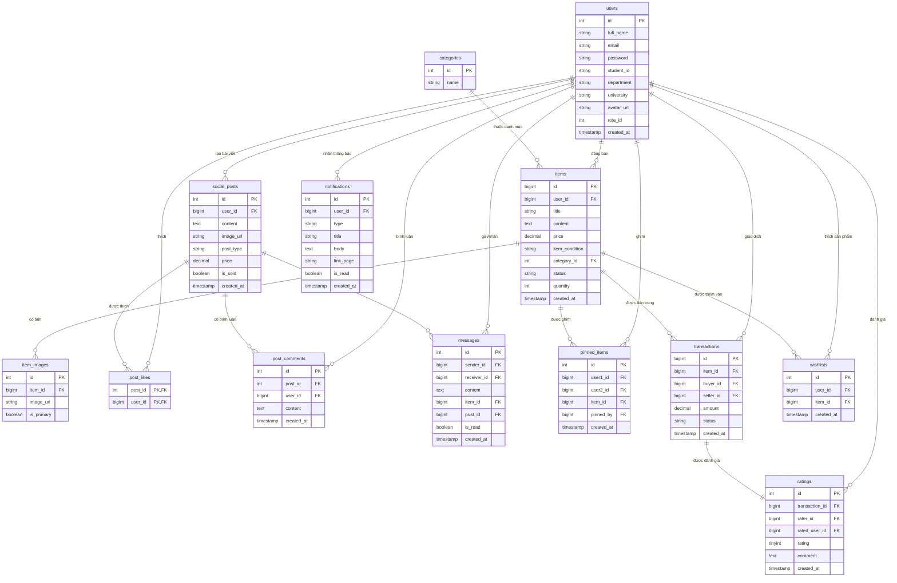

### 3.2. Đặc tả chi tiết các bảng trong cơ sở dữ liệu

#### 3.2.1. Bảng `users` (Tài khoản người dùng)
Lưu trữ thông tin tài khoản của sinh viên và quản trị viên hệ thống.
* **id (INT, PK, Auto Increment):** Mã định danh duy nhất của người dùng.
* **full_name (VARCHAR(255)):** Họ và tên sinh viên.
* **email (VARCHAR(255), UNIQUE):** Địa chỉ email sinh viên (thường dùng email trường).
* **password (VARCHAR(255)):** Mật khẩu tài khoản (được mã hóa dạng Bcrypt).
* **student_id (VARCHAR(50)):** Mã số sinh viên.
* **department (VARCHAR(100)):** Khoa/Viện đào tạo.
* **university (VARCHAR(255)):** Tên trường Đại học.
* **avatar_url (VARCHAR(255)):** Đường dẫn ảnh đại diện.
* **role_id (INT):** Vai trò (1: Admin, 2: Student).
* **created_at (TIMESTAMP):** Thời điểm đăng ký.

#### 3.2.2. Bảng `items` (Sản phẩm chợ sinh viên)
Chứa các tin đăng bán hoặc thanh lý đồ cũ của sinh viên.
* **id (BIGINT, PK, Auto Increment):** Mã sản phẩm.
* **user_id (BIGINT, FK):** Mã sinh viên đăng bán.
* **title (VARCHAR(255)):** Tiêu đề tin đăng bán.
* **content (TEXT):** Mô tả chi tiết tình trạng sản phẩm.
* **price (DECIMAL(10,2)):** Giá bán (bằng 0 nếu là tặng miễn phí).
* **item_condition (VARCHAR(50)):** Tình trạng sản phẩm (Mới, Đã dùng tốt, Cũ...).
* **category_id (INT, FK):** Danh mục sản phẩm (sách, điện tử, đồ gia dụng...).
* **status (ENUM):** Trạng thái sản phẩm (`AVAILABLE` - Sẵn sàng, `SOLD` - Đã bán).
* **quantity (INT):** Số lượng sản phẩm có sẵn (mặc định = 1).
* **created_at (TIMESTAMP):** Thời điểm đăng bán.

#### 3.2.3. Bảng `item_images` (Hình ảnh sản phẩm)
Cho phép một sản phẩm có nhiều hình ảnh đi kèm để tăng độ uy tín.
* **id (INT, PK, Auto Increment):** Mã ảnh.
* **item_id (BIGINT, FK):** Mã sản phẩm tham chiếu.
* **image_url (VARCHAR(255)):** Đường dẫn hình ảnh lưu tại server.
* **is_primary (BOOLEAN):** Xác định đây là ảnh đại diện của sản phẩm.

#### 3.2.4. Bảng `categories` (Danh mục sản phẩm)
Các thể loại đồ dùng được hệ thống định nghĩa sẵn.
* **id (INT, PK, Auto Increment):** Mã danh mục.
* **name (VARCHAR(100)):** Tên danh mục (ví dụ: Đồ dùng học tập, Đồ dùng KTX, Thiết bị điện tử...).

#### 3.2.5. Bảng `social_posts` (Bài viết cộng đồng)
Các bài viết chia sẻ, thảo luận, giao lưu hoặc tin đăng bán nhanh trên bảng tin (Social Feed).
* **id (INT, PK, Auto Increment):** Mã bài viết.
* **user_id (BIGINT, FK):** Người đăng bài.
* **content (TEXT):** Nội dung chia sẻ.
* **image_url (VARCHAR(255)):** Ảnh đính kèm bài viết.
* **post_type (ENUM):** Loại bài đăng (`NORMAL` - chia sẻ bình thường, `SALE` - bài bán nhanh).
* **price (DECIMAL(10,2)):** Giá bán (nếu là bài `SALE`).
* **is_sold (BOOLEAN):** Đánh dấu bài bán nhanh đã thanh lý xong.
* **created_at (TIMESTAMP):** Thời điểm đăng bài.

#### 3.2.6. Bảng `messages` (Tin nhắn trực tiếp)
Hỗ trợ nhắn tin riêng tư giữa người mua và người bán, đặc biệt có liên kết ngữ cảnh sản phẩm.
* **id (INT, PK, Auto Increment):** Mã tin nhắn.
* **sender_id (INT, FK):** Người gửi tin.
* **receiver_id (INT, FK):** Người nhận tin.
* **content (TEXT):** Nội dung tin nhắn chữ.
* **item_id (BIGINT, FK, NULL):** Liên kết ngữ cảnh sản phẩm người mua đang hỏi.
* **post_id (BIGINT, FK, NULL):** Liên kết bài viết cộng đồng liên quan.
* **is_read (BOOLEAN):** Đánh dấu tin nhắn đã đọc hay chưa.
* **created_at (TIMESTAMP):** Thời gian gửi.

#### 3.2.7. Bảng `pinned_items` (Sản phẩm ghim trong chat)
Cho phép hai người dùng đang chat ghim một sản phẩm cụ thể lên đầu khung chat để nhanh chóng thỏa thuận và tạo giao dịch.
* **id (INT, PK, Auto Increment):** Mã ghim.
* **user1_id, user2_id (BIGINT, FK):** Cặp người dùng trò chuyện (được chuẩn hóa min/max ID để tránh trùng lặp).
* **item_id (BIGINT, FK):** Sản phẩm được ghim.
* **pinned_by (BIGINT):** Người thực hiện thao tác ghim.

#### 3.2.8. Bảng `transactions` (Giao dịch mua bán)
Quản lý lịch sử và trạng thái đơn hàng trao đổi giữa sinh viên.
* **id (BIGINT, PK, Auto Increment):** Mã giao dịch.
* **item_id (BIGINT, FK):** Sản phẩm giao dịch.
* **buyer_id (BIGINT, FK):** Người mua.
* **seller_id (BIGINT, FK):** Người bán.
* **amount (DECIMAL(10,2)):** Số tiền thanh toán.
* **status (ENUM):** Trạng thái đơn hàng (`PENDING` - Chờ xác nhận, `SHIPPING` - Đang giao, `COMPLETED` - Thành công, `CANCELLED` - Đã hủy).
* **created_at (TIMESTAMP):** Thời gian tạo giao dịch.

#### 3.2.9. Bảng `ratings` (Đánh giá & Phản hồi)
Giúp xây dựng hệ thống uy tín cho sinh viên sau khi hoàn thành giao dịch.
* **id (INT, PK, Auto Increment):** Mã đánh giá.
* **transaction_id (BIGINT, FK):** Giao dịch tương ứng.
* **rater_id (BIGINT, FK):** Người thực hiện đánh giá.
* **rated_user_id (BIGINT, FK):** Người được đánh giá.
* **rating (TINYINT):** Điểm đánh giá từ 1 đến 5 sao.
* **comment (TEXT):** Ý kiến phản hồi chi tiết.

#### 3.2.10. Bảng `notifications` (Thông báo người dùng)
Gửi thông tin cập nhật trạng thái giao dịch, tin nhắn mới, lượt tương tác bài đăng.
* **id (INT, PK, Auto Increment):** Mã thông báo.
* **user_id (BIGINT, FK):** Người nhận thông báo.
* **type (VARCHAR(50)):** Phân loại thông báo (CHAT, TRANSACTION, SYSTEM, LIKE).
* **title (VARCHAR(255)):** Tiêu đề thông báo.
* **body (TEXT):** Chi tiết nội dung thông báo.
* **link_page (VARCHAR(50)):** Trang điều hướng trên client khi click (ví dụ: `history`, `messages`).
* **is_read (BOOLEAN):** Trạng thái đọc thông báo.

#### 3.2.11. Bảng `post_likes` (Lượt thích bài viết)
Liên kết Nhiều-Nhiều giữa người dùng và bài đăng cộng đồng (sinh viên thích bài viết).
* **post_id (INT, PK, FK):** Mã bài viết được thích.
* **user_id (BIGINT, PK, FK):** Mã sinh viên đã thích bài viết.

#### 3.2.12. Bảng `post_comments` (Bình luận bài viết)
Các bình luận trao đổi của sinh viên dưới bài đăng cộng đồng.
* **id (INT, PK, Auto Increment):** Mã bình luận.
* **post_id (INT, FK):** Bài viết chứa bình luận.
* **user_id (BIGINT, FK):** Người dùng viết bình luận.
* **content (TEXT):** Nội dung bình luận.
* **created_at (TIMESTAMP):** Thời điểm bình luận.

#### 3.2.13. Bảng `wishlists` (Sản phẩm yêu thích)
Lưu lại danh sách các sản phẩm chợ đồ cũ sinh viên đang quan tâm.
* **id (INT, PK, Auto Increment):** Mã danh sách yêu thích.
* **user_id (BIGINT, FK):** Người dùng đã thích sản phẩm.
* **item_id (BIGINT, FK):** Sản phẩm được thêm vào danh sách yêu thích.
* **created_at (TIMESTAMP):** Thời điểm thêm.

### 3.3. Mô tả mối liên kết giữa các bảng trong cơ sở dữ liệu

Cơ sở dữ liệu của dự án GreenCampus được thiết kế chuẩn hóa nhằm tối ưu hóa hiệu năng truy vấn và duy trì tính toàn vẹn dữ liệu thông qua các ràng buộc khóa ngoại (Foreign Key Constraints) và hành vi CASCADE / RESTRICT khi cập nhật hoặc xóa dữ liệu. Dưới đây là mô tả chi tiết các mối liên kết chính:

#### 3.3.1. Các mối liên kết xoay quanh thực thể `users` (Người dùng)
Thực thể `users` là trung tâm của toàn bộ hệ thống, liên kết trực tiếp với hầu hết các bảng khác qua mối quan hệ **Một-Nhiều (1:N)**:
* **`users` và `items` (1:N):** Một người dùng có thể đăng bán nhiều sản phẩm. Khóa ngoại `items.user_id` liên kết đến `users.id` kèm điều kiện `ON DELETE CASCADE` (nếu tài khoản người dùng bị xóa, các sản phẩm họ đăng bán cũng tự động xóa).
* **`users` và `social_posts` (1:N):** Một người dùng có thể đăng nhiều bài chia sẻ cộng đồng. Khóa ngoại `social_posts.user_id` tham chiếu đến `users.id`.
* **`users` và `post_likes` (1:N):** Người dùng tương tác thích bài viết. Bảng `post_likes` là bảng liên kết trung gian biểu diễn quan hệ Nhiều-Nhiều (N:M) giữa `users` và `social_posts`, có khóa ngoại trỏ về `users.id`.
* **`users` và `post_comments` (1:N):** Người dùng có thể bình luận nhiều bài đăng. Khóa ngoại `post_comments.user_id` trỏ về `users.id`.
* **`users` và `messages` (1:N):** Trong một tin nhắn, có hai mối liên kết đến người dùng: `sender_id` (người gửi) và `receiver_id` (người nhận) đều là khóa ngoại trỏ về `users.id`.
* **`users` và `transactions` (1:N):** Một giao dịch ghi nhận hai thực thể người dùng: `buyer_id` (người mua) và `seller_id` (người bán) đều là khóa ngoại trỏ về `users.id`.
* **`users` và `ratings` (1:N):** Đánh giá ghi nhận `rater_id` (người đánh giá) và `rated_user_id` (người nhận đánh giá) trỏ về `users.id`.
* **`users` và `notifications` (1:N):** Nhận thông báo. Khóa ngoại `notifications.user_id` liên kết đến `users.id`.
* **`users` và `wishlists` (1:N):** Một người dùng có thể lưu nhiều sản phẩm yêu thích. Khóa ngoại `wishlists.user_id` trỏ về `users.id`.

#### 3.3.2. Các mối liên kết xoay quanh thực thể `items` (Sản phẩm chợ sinh viên)
Thực thể `items` đóng vai trò quan trọng trong phân hệ thương mại điện tử:
* **`categories` và `items` (1:N):** Nhiều sản phẩm thuộc về một danh mục định sẵn. Khóa ngoại `items.category_id` tham chiếu đến `categories.id` với ràng buộc `ON DELETE RESTRICT` (không cho phép xóa danh mục nếu đang có sản phẩm thuộc danh mục đó).
* **`items` và `item_images` (1:N):** Một sản phẩm có thể có nhiều hình ảnh thực tế đi kèm. Khóa ngoại `item_images.item_id` trỏ về `items.id` với ràng buộc `ON DELETE CASCADE`.
* **`items` và `transactions` (1:N):** Một sản phẩm có thể xuất hiện trong nhiều giao dịch (nếu có số lượng nhiều). Khóa ngoại `transactions.item_id` tham chiếu đến `items.id`.
* **`items` và `wishlists` (1:N):** Một sản phẩm được yêu thích bởi nhiều người dùng khác nhau. Khóa ngoại `wishlists.item_id` trỏ về `items.id`.
* **`items` và `pinned_items` (1:N):** Sản phẩm được ghim trong các cuộc hội thoại. Khóa ngoại `pinned_items.item_id` tham chiếu đến `items.id`.

#### 3.3.3. Các mối liên kết xoay quanh phân hệ Cộng đồng (`social_posts`)
* **`social_posts` và `post_likes` (1:N):** Một bài viết nhận nhiều lượt thích từ các thành viên. Khóa ngoại `post_likes.post_id` trỏ về `social_posts.id` với ràng buộc `ON DELETE CASCADE`.
* **`social_posts` và `post_comments` (1:N):** Một bài viết có nhiều bình luận. Khóa ngoại `post_comments.post_id` trỏ về `social_posts.id` với ràng buộc `ON DELETE CASCADE`.
* **`social_posts` và `messages` (1:N, tùy chọn):** Tin nhắn có thể chứa liên kết ngữ cảnh đến bài đăng cộng đồng (nếu người mua nhắn tin từ bài thanh lý nhanh). Khóa ngoại `messages.post_id` trỏ về `social_posts.id` và chấp nhận giá trị `NULL`.

#### 3.3.4. Các mối liên kết xoay quanh Giao dịch (`transactions`)
* **`transactions` và `ratings` (1:1):** Mỗi giao dịch mua bán thành công chỉ được phép tạo tối đa một phản hồi đánh giá uy tín duy nhất. Khóa ngoại `ratings.transaction_id` trỏ về `transactions.id` và được đặt ràng buộc `UNIQUE` để đảm bảo quan hệ 1:1.

---


## 4. THIẾT KẾ KIẾN TRÚC & CÁC TRANG GIAO DIỆN (UI/UX DESIGN)

### 4.1. Kiến trúc luồng giao diện Frontend

Ứng dụng React được thiết kế theo mô hình **Single Page Application (SPA)** mượt mà, quản lý trạng thái tập trung tại `App.jsx`. Điều hướng trang sử dụng state `currentPage` thay vì thư viện router truyền thống để tăng tốc độ tải trang và lưu trữ trạng thái người dùng tức thời.

```mermaid
graph TD
    App[App.jsx - Root State Container] --> Header[Header.jsx - Thanh điều hướng & Tìm kiếm]
    App --> AuthPage{authPage State}
    
    AuthPage -- "login" --> LoginPage[LoginPage.jsx]
    AuthPage -- "register" --> RegisterPage[RegisterPage.jsx]
    
    App --> MainView{currentPage State}
    
    MainView -- "home" --> HomePage[Trang chủ & Danh sách sản phẩm]
    HomePage --> Hero[Hero banner & Danh mục nhanh]
    HomePage --> QuickActions[Thao tác nhanh]
    HomePage --> ProductGrid[Lưới sản phẩm nổi bật]
    HomePage --> CategoryGridView[Xem theo danh mục / Tìm kiếm]
    
    MainView -- "feed" --> SocialFeedPage[SocialFeed.jsx - Bản tin sinh viên]
    SocialFeedPage --> CreatePostBox[Hộp tạo bài đăng nhanh]
    SocialFeedPage --> PostCard[Danh sách thẻ bài đăng]
    
    MainView -- "messages" --> MessagePage[MessagePage.jsx - Khung chat]
    MessagePage --> ChatList[Danh sách hội thoại]
    MessagePage --> ChatBox[Khung chat chi tiết & Ghim sản phẩm]
    
    MainView -- "profile" --> ProfilePage[Trang cá nhân & Cửa hàng của tôi]
    MainView -- "cart" --> CartPage[Giỏ hàng & Chọn mua]
    MainView -- "checkout" --> CheckoutPage[Trang điền thông tin & Xác nhận đơn]
    MainView -- "history" --> HistoryPage[Lịch sử đơn hàng & Đánh giá]
    MainView -- "green-life" --> GreenLifePage[Trang hướng dẫn Lối sống xanh]
    MainView -- "settings" --> SettingsPage[Chỉnh sửa thông tin tài khoản]
    
    App --> ProductDetailPage[ProductDetailPage.jsx - Chi tiết sản phẩm]
    App --> StoreProfilePage[StoreProfilePage.jsx - Trang cá nhân của người bán khác]
```

### 4.2. Chi tiết các module giao diện chính

#### 4.2.1. Trang chủ & Chợ sinh viên (Marketplace)
* **Chức năng:** Hiển thị Banner truyền cảm hứng sống xanh (`Hero.jsx`), danh mục sản phẩm trực quan, thanh tìm kiếm thông minh hỗ trợ tìm kiếm sản phẩm theo tên, và lưới sản phẩm (`ProductGrid.jsx`) hiển thị các món đồ đang được rao bán cùng trường.
* **Đặc điểm nổi bật:** Sử dụng các tone màu dịu nhẹ của lá cây (#2D6A4F làm chủ đạo) mang tính biểu tượng thân thiện với môi trường, các hiệu ứng hover mượt mà và hiển thị trạng thái sản phẩm rõ ràng.

#### 4.2.2. Chi tiết sản phẩm & Cửa hàng người bán
* **Chức năng:** Xem thông tin mô tả chi tiết, tình trạng cũ/mới, số lượng và giá của sản phẩm (`ProductDetailPage.jsx`). Người dùng có thể nhấn **Mua ngay**, **Thêm vào giỏ** hoặc **Chat với người bán**.
* **Trang người bán (`StoreProfilePage.jsx`):** Hiển thị toàn bộ các sản phẩm mà người bán đó đang đăng, đánh giá trung bình từ cộng đồng giúp người mua tự tin hơn khi giao dịch.

#### 4.2.3. Bản tin cộng đồng (Social Feed)
* **Chức năng:** Diễn đàn giao lưu nội bộ trường học. Sinh viên có thể chia sẻ các mẹo tái chế đồ cũ, thông báo nhặt được đồ rơi, gom nhóm đi chung xe, hoặc đăng bán nhanh một sản phẩm (`CreatePostBox.jsx`).
* **Tương tác:** Cho phép thả tim (Like) và bình luận (Comment) thời gian thực dưới mỗi bài đăng.

#### 4.2.4. Khung nhắn tin ngữ cảnh (Contextual Chat)
* **Chức năng:** Trò chuyện trực tiếp giữa người mua và người bán. Điểm độc đáo là hệ thống cho phép ghim sản phẩm đang bàn luận lên đầu cuộc trò chuyện.
* **Lợi ích:** Người mua có thể click trực tiếp vào sản phẩm ghim để xem chi tiết hoặc bấm "Tạo giao dịch" ngay tại chỗ mà không cần thoát khỏi cuộc trò chuyện.

#### 4.2.5. Trang "Sống xanh" (Green Life)
* **Chức năng:** Tuyên truyền 10 nguyên tắc Living Lab về phát triển bền vững của trường Đại học xanh (giao thông xanh, hạn chế rác thải, năng lượng hiệu quả, ăn uống lành mạnh...).
* **Ý nghĩa:** Định hướng hành vi của sinh viên, nhắc nhở họ về tầm quan trọng của việc tái sử dụng đồ dùng cũ để giảm thiểu khí thải Carbon.

#### 4.2.6. Trang quản trị viên (Admin Dashboard)
* **Chức năng:**
  * **Thống kê:** Biểu đồ tổng quan số thành viên đăng ký mới, số giao dịch thành công, tổng số kg rác thải ước tính được giảm thiểu nhờ hoạt động tái sử dụng đồ cũ.
  * **Quản lý tài khoản:** Khóa các tài khoản giả mạo, spam hoặc lừa đảo.
  * **Kiểm duyệt bài đăng:** Xóa các tin đăng bán vũ khí, chất cấm hoặc bài viết vi phạm chuẩn mực cộng đồng.
  * **Quản lý danh mục:** Thêm mới các danh mục sản phẩm theo nhu cầu phát triển của trường.

---

## 5. CÁC LUỒNG NGHIỆP VỤ QUAN TRỌNG (KEY BUSINESS FLOWS)

### 5.1. Luồng Đăng ký & Đăng nhập (Authentication Flow)

Quy trình đăng ký tài khoản mới và đăng nhập vào hệ thống để lấy mã JWT xác thực các cuộc gọi API:

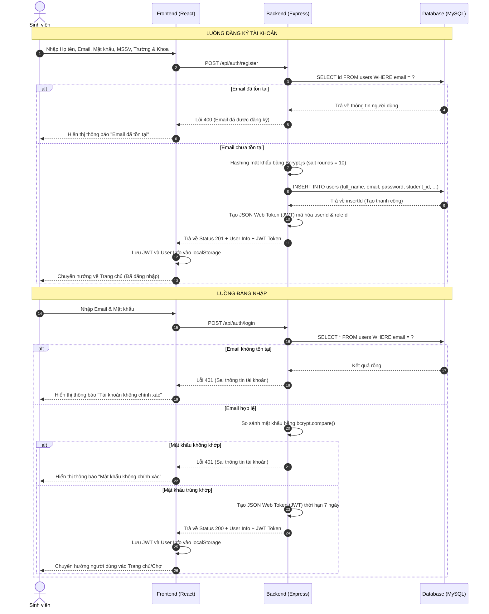

### 5.2. Luồng Đăng bán sản phẩm tích hợp hỗ trợ AI (AI-assisted Product Listing Flow)

Quy trình đăng bán sản phẩm kết hợp tải ảnh và gọi API trí tuệ nhân tạo Gemini để tự động điền các thông tin mô tả sản phẩm:

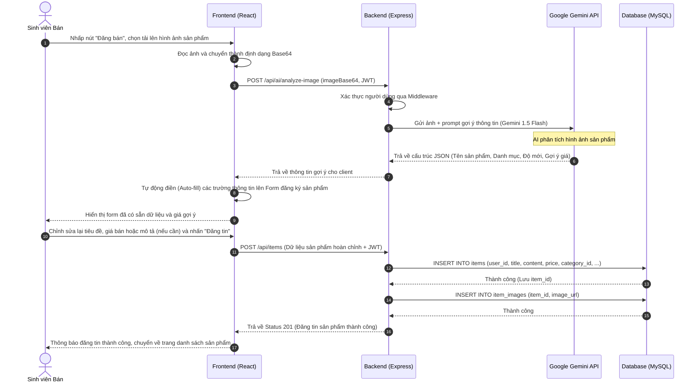

### 5.3. Luồng Đặt hàng & Tạo giao dịch (Order Checkout Flow)

Quy trình người mua thực hiện đặt đơn hàng từ giỏ hàng, thực hiện trừ số lượng trong kho và tạo thông báo tới người bán:

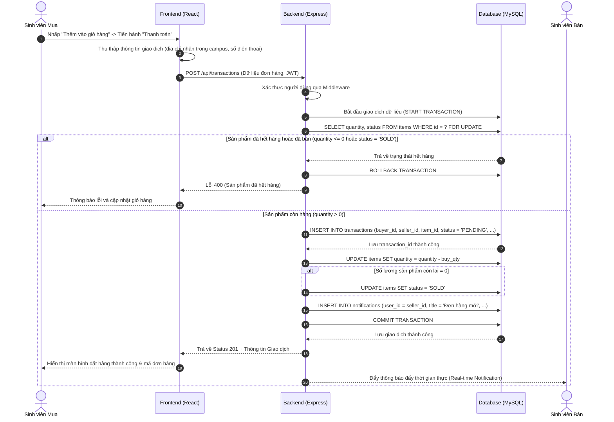

### 5.4. Nhắn tin trực tiếp & Ghim sản phẩm trong Chat (Contextual Chat Flow)

Khởi tạo hội thoại trò chuyện trao đổi có kèm ngữ cảnh sản phẩm cụ thể và các tương tác ghim tin nhắn trực tiếp trong luồng chat:

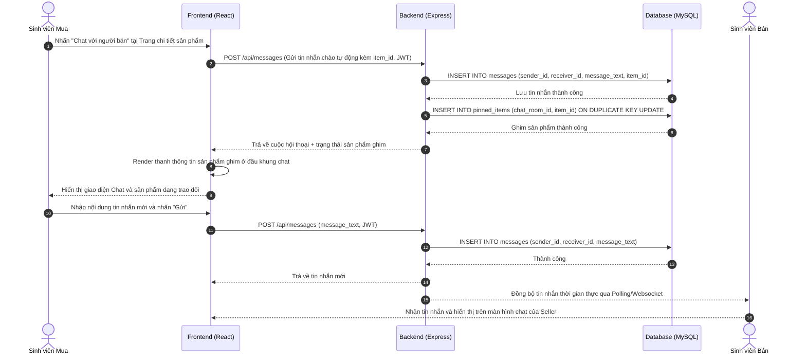

### 5.5. Luồng Trò chuyện với Trợ lý Sống Xanh AI (AI Green Assistant Chatbot Flow)

Hệ thống cho phép sinh viên hỏi đáp trực tiếp với Trợ lý AI để giải đáp các chính sách ứng dụng hoặc tư vấn cách thức sống xanh, tiết kiệm năng lượng:

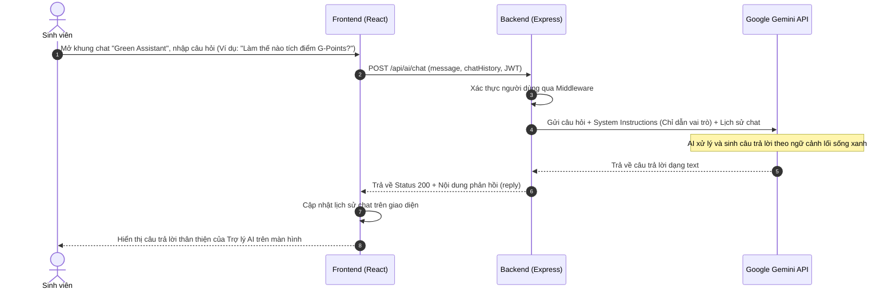

### 5.6. Luồng Tương tác bài đăng cộng đồng (Social Feed Flow)

Các tương tác cộng đồng bao gồm thả tim (Like) hoặc viết bình luận (Comment) dưới các bài viết chia sẻ:

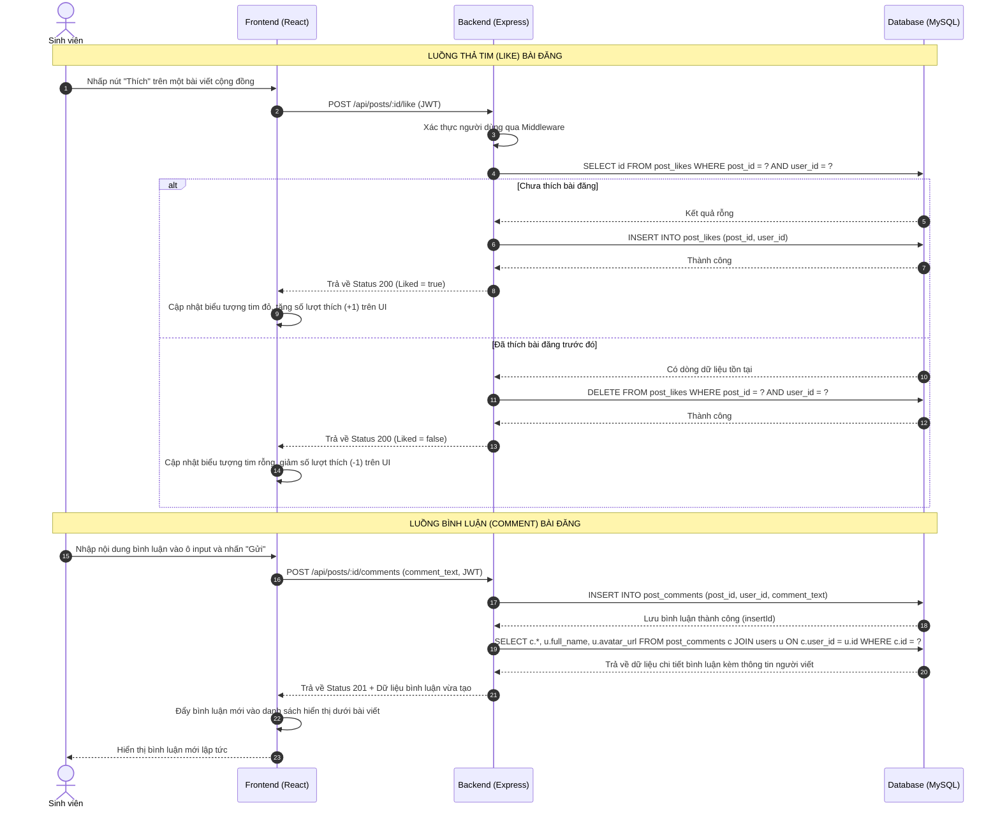

### 5.7. Luồng Kiểm duyệt nội dung của Quản trị viên (Admin Content Moderation Flow)

Quy trình quản trị viên thực hiện xem các vi phạm và tiến hành xóa bài viết hoặc khóa tài khoản thành viên vi phạm quy chế trường học:

```mermaid
sequenceDiagram
    autonumber
    actor Admin as Quản trị viên
    participant FE as Frontend (React)
    participant BE as Backend (Express)
    participant DB as Database (MySQL)

    Admin->>FE: Đăng nhập vào Admin Dashboard -> Chọn trang quản lý
    Admin->>FE: Nhấn "Xóa bài viết" hoặc "Khóa tài khoản" vi phạm chính sách
    FE->>BE: DELETE /api/admin/posts/:id hoặc PUT /api/admin/users/:id/ban (JWT)
    BE->>BE: Kiểm tra phân quyền (Middleware check role_id = ADMIN)
    alt Không phải Admin
        BE-->>FE: Lỗi 403 (Không có quyền truy cập)
        FE-->>Admin: Hiển thị thông báo "Từ chối truy cập"
    else Xác thực Admin thành công
        alt Trường hợp xóa bài viết
            BE->>DB: DELETE FROM social_posts WHERE id = ?
        else Trường hợp khóa tài khoản
            BE->>DB: UPDATE users SET is_active = 0 WHERE id = ?
        end
        DB-->>BE: Thành công
        BE-->>FE: Trả về Status 200 (Cập nhật thành công)
        FE->>FE: Xóa bài viết khỏi danh sách hiển thị hoặc đổi trạng thái người dùng trên bảng quản trị
        FE-->>Admin: Hiển thị thông báo "Thực hiện thành công"
    end

---

## 6. SƠ ĐỒ HOẠT ĐỘNG (ACTIVITY DIAGRAMS)

Sơ đồ hoạt động (Activity Diagram) tập trung vào luồng xử lý và các bước thực hiện của hệ thống, giúp làm rõ các điều kiện rẽ nhánh và các quyết định nghiệp vụ.

### 6.1. Sơ đồ hoạt động Đăng ký & Đăng nhập (Authentication Activity)

```mermaid
graph TD
    Start([Bắt đầu]) --> SelectAction{Chọn tác vụ}
    SelectAction -->|Đăng ký| FillRegister[Nhập Họ tên, Email, Mật khẩu, MSSV, Khoa]
    SelectAction -->|Đăng nhập| FillLogin[Nhập Email và Mật khẩu]
    
    %% Đăng ký flow
    FillRegister --> SubReg[Gửi yêu cầu đăng ký]
    SubReg --> CheckEmail{Email đã tồn tại?}
    CheckEmail -->|Đúng| ShowRegErr[Hiển thị lỗi: Email đã đăng ký]
    ShowRegErr --> FillRegister
    CheckEmail -->|Sai| HashPass[Băm mật khẩu bằng Bcrypt]
    HashPass --> CreateUser[Lưu tài khoản mới vào database]
    CreateUser --> GenTokenReg[Tạo JWT Token đăng nhập]
    GenTokenReg --> SaveTokenReg[Lưu JWT vào localStorage]
    SaveTokenReg --> MainHome[Điều hướng về Trang chủ]
    
    %% Đăng nhập flow
    FillLogin --> SubLog[Gửi yêu cầu đăng nhập]
    SubLog --> CheckUserExist{Email có tồn tại?}
    CheckUserExist -->|Sai| ShowLogErr1[Hiển thị lỗi: Email không tồn tại]
    ShowLogErr1 --> FillLogin
    CheckUserExist -->|Đúng| MatchPass{Mật khẩu trùng khớp?}
    MatchPass -->|Sai| ShowLogErr2[Hiển thị lỗi: Sai mật khẩu]
    ShowLogErr2 --> FillLogin
    MatchPass -->|Đúng| GenTokenLog[Tạo JWT Token thời hạn 7 ngày]
    GenTokenLog --> SaveTokenLog[Lưu JWT vào localStorage]
    SaveTokenLog --> MainHome
    
    MainHome --> End([Kết thúc])
```

### 6.2. Sơ đồ hoạt động Đăng bán sản phẩm có hỗ trợ AI (AI-assisted Product Listing Activity)

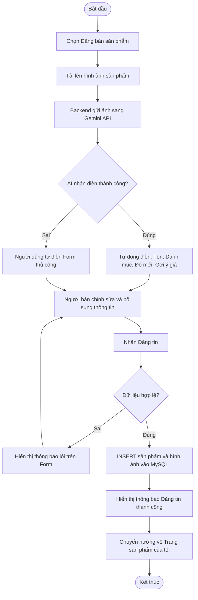

### 6.3. Sơ đồ hoạt động Đặt hàng & Thanh toán (Order Checkout Activity)

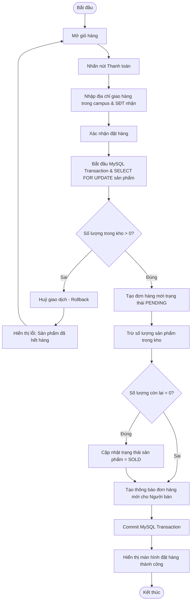

### 6.4. Sơ đồ hoạt động Chat ngữ cảnh & Ghim sản phẩm (Contextual Chat Activity)

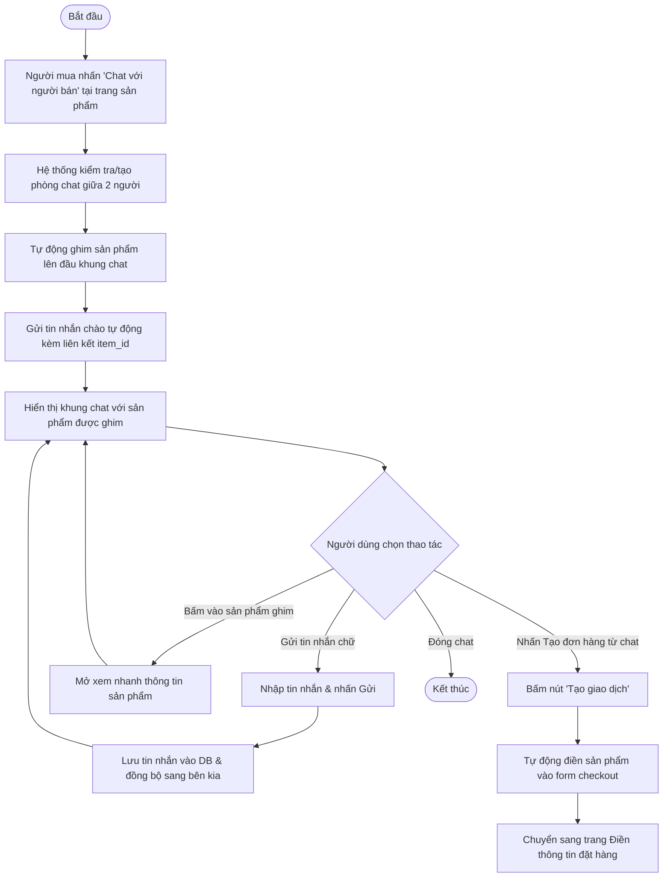

### 6.5. Sơ đồ hoạt động Trò chuyện với Trợ lý AI Sống Xanh (AI Green Assistant Chatbot Activity)

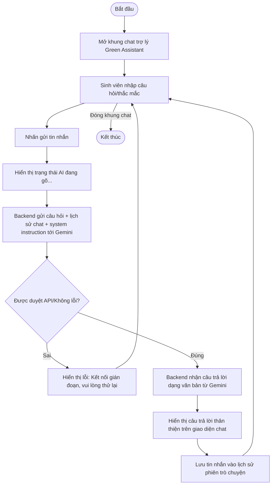

---

## 7. HƯỚNG DẪN CÀI ĐẶT & VẬN HÀNH DỰ ÁN

### 7.1. Yêu cầu môi trường
* Đã cài đặt **Node.js** (Khuyến nghị phiên bản LTS 18 hoặc 20 trở lên).
* Đã cài đặt hệ quản trị cơ sở dữ liệu **MySQL Server**.

### 7.2. Cấu hình Biến môi trường
Tạo file `.env` nằm trong thư mục `backend/` với nội dung cấu hình kết nối database cục bộ:
```env
PORT=5000
DB_HOST=localhost
DB_USER=root
DB_PASS=your_mysql_password
DB_NAME=green_campus
JWT_SECRET=greencampus_jwt_secret_key_2026
JWT_EXPIRES_IN=7d
```

### 7.3. Các bước khởi động dự án

#### Bước 1: Khởi động Backend
```bash
cd backend
npm install
npm run dev
```
*Lưu ý:* Khi Backend khởi động lần đầu tiên, file `src/config/db.js` sẽ tự động thực hiện các câu lệnh kiểm tra và tạo toàn bộ 12 bảng trong database `green_campus`, đồng thời cấu hình sẵn các danh mục sản phẩm mặc định.

#### Bước 2: Khởi động Frontend
```bash
cd fontend
npm install
npm run dev
```
Ứng dụng sẽ chạy tại địa chỉ `http://localhost:5173`. Ứng dụng client sẽ tự động gọi API tới cổng `5000` của Backend.

---

## 8. KẾT LUẬN & HƯỚNG PHÁT TRIỂN

### 8.1. Kết quả đạt được
* **Về mặt kỹ thuật:** Xây dựng thành công hệ thống Single Page Application hoàn chỉnh với React.js kết hợp API backend mạnh mẽ bằng Express và cơ sở dữ liệu MySQL ổn định. Các luồng xử lý phức tạp như đồng bộ số lượng hàng trong kho, ghim sản phẩm trong chat và phân quyền người dùng hoạt động trơn tru.
* **Về ý nghĩa thực tiễn:** Nền tảng giải quyết trực tiếp nhu cầu thanh lý đồ cũ của sinh viên, tiết kiệm chi phí học tập, đồng thời tuyên truyền và lan tỏa lối sống xanh, giảm thiểu rác thải sinh hoạt trong trường học theo mô hình "GreenCampus Living Lab".

### 8.2. Hướng phát triển trong tương lai
1. **Tích hợp cổng thanh toán trực tuyến:** Kết nối các ví điện tử phổ biến như Momo, Zalopay hoặc cổng VNPay để hỗ trợ thanh toán không tiền mặt tiện lợi.
2. **Hệ thống Điểm thưởng Sống Xanh (G-Points):** Tích lũy điểm thưởng cho mỗi giao dịch đồ cũ thành công hoặc bài viết chia sẻ mẹo tái chế hữu ích. Điểm G-Points này có thể dùng để đổi quà, voucher giảm giá tại căn tin trường hoặc các đặc quyền học tập khác.
3. **Phát triển ứng dụng di động (Mobile App):** Sử dụng React Native để đóng gói ứng dụng lên Android và iOS nhằm gửi thông báo đẩy (push notification) thời gian thực và cho phép quét mã QR giao dịch nhanh chóng.
